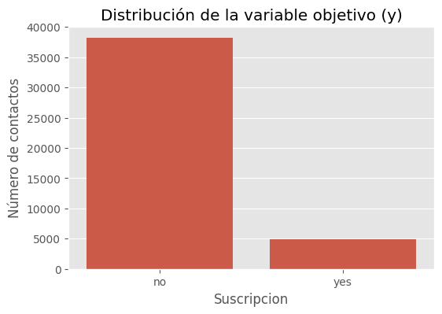
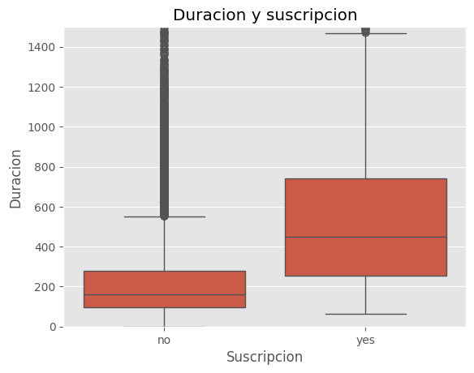
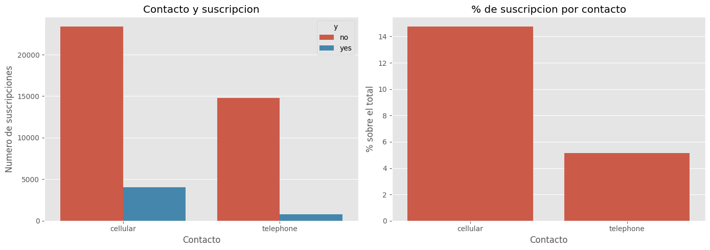
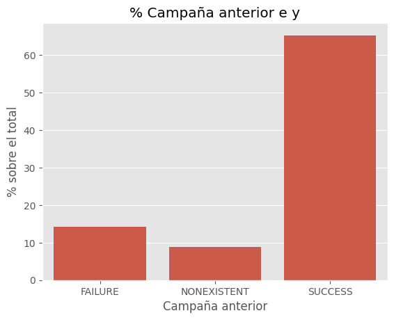
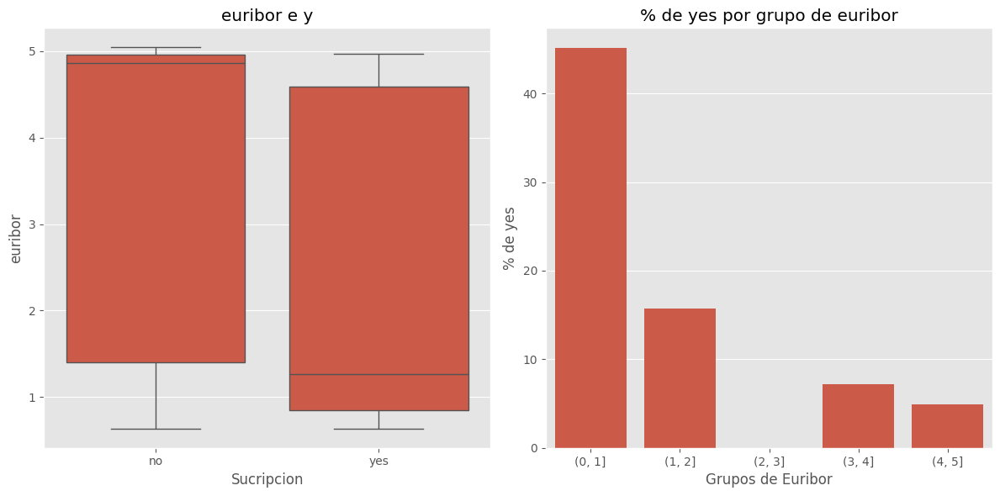
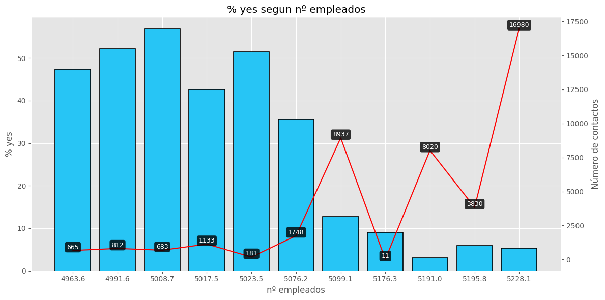
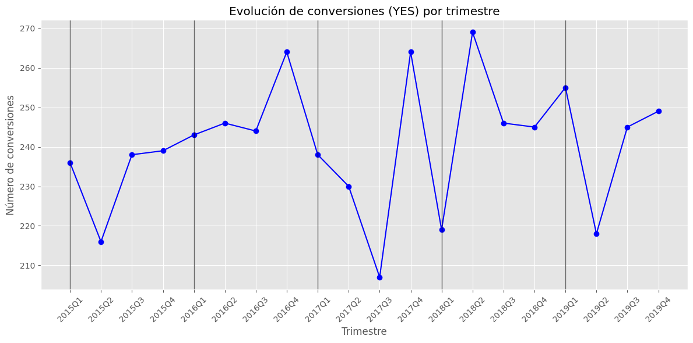

# Proyecto: 

## 1. Objetivo

El objetivo de este proyecto es realizar un Análisis Exploratorio de Datos (EDA) utilizando Python, con el fin de comprender el comportamiento de los clientes de una entidad bancaria portuguesa y analizar qué variables influyen en la suscripción de un producto financiero (depósito a plazo fijo).

A partir de dos conjuntos de datos —uno relacionado con campañas de marketing directo y otro con información demográfica y de comportamiento de los clientes— se busca identificar patrones, relaciones y factores relevantes que permitan explicar la variable objetivo y (suscripción del producto: sí/no).

Para ello, se llevará a cabo un proceso completo de análisis de datos que incluye:

Limpieza y transformación de los datos para garantizar su calidad y coherencia.
Análisis descriptivo de las variables para comprender su distribución y características principales.
Visualización de datos para identificar patrones, tendencias y relaciones significativas.
Análisis e interpretación de resultados con el objetivo de extraer conclusiones basadas en datos.

## 2. Dataset

### 📌 Fuente  

Los datos utilizados en este proyecto provienen de un conjunto de datos proporcionado para la realización del módulo *Python for Data*.  

Están basados en campañas de marketing directo de una institución bancaria portuguesa, realizadas principalmente a través de llamadas telefónicas.

---

### 📊 Descripción de los datasets  

En este proyecto se trabajan **dos conjuntos de datos principales**:

---

#### 1. `bank-additional.csv`  

Este dataset contiene información relacionada con campañas de marketing bancario.  

El objetivo del análisis es predecir si un cliente suscribirá un depósito a plazo fijo tras las campañas de contacto.

Incluye variables:

- Demográficas (edad, estado civil, educación, etc.)
- Económicas (índices macroeconómicos)
- De comportamiento (número de contactos, duración de la llamada, etc.)
- Información de la campaña de marketing

**Variable objetivo:**

- `y`: indica si el cliente suscribió el producto (Sí / No)

---

#### 2. `customer-details.xlsx`  

Este dataset contiene información adicional sobre los clientes, enfocada en características demográficas y comportamiento de compra.

Está estructurado en **3 hojas de trabajo**, correspondientes a clientes de diferentes años.

Incluye variables como:

- Ingresos anuales
- Número de niños en el hogar (`Kidhome`)
- Número de adolescentes en el hogar (`Teenhome`)
- Fecha de alta como cliente (`Dt_Customer`)
- Visitas mensuales a la web (`NumWebVisitsMonth`)
- Identificador del cliente (`ID`)

---

### 🔄 Transformación de los datos  

Tras la limpieza, transformación y unión de los datasets, se obtuvo un dataset final con:

- **43.000 filas**
- **25 columnas** 

## 3. Tecnologías utilizadas

- Python
- Pandas
- NumPy
- Matplotlib
- Seaborn
- Visual Studio Code

## 4. Estructura del proyecto

PROYECTO_EDA/                        # Entorno virtual
│
├── Data/
│   ├── raw/                        # Datos originales
│   │   ├── bank-additional.csv
│   │   └── customer-details.xlsx
│   │
│   ├── interim/                    # Datos tras una primera limpieza
│   │   ├── b_add_interim.csv
│   │   └── df_customer_interim.csv
│   │
│   ├── cleaned/                    # Datos completamente limpios
│   │   └── df_cleaned.csv
│   │
│   └── processed/                  # Dataset final para el análisis
│       └── df_processed.csv
│
├── notebooks/
│   ├── 01_exploracion.ipynb        # Análisis exploratorio de los datos
│   ├── 02_limpieza.ipynb           # Limpieza y transformación
│   └── 03_analisis.ipynb           # Análisis y visualizaciones
│
├── requirements.txt                # Dependencias del proyecto
└── README.md                       # Documentación del proyecto

## 5. Cómo ejecutar el proyecto

1. Crear el entorno virtual
2. Instalar dependencias
3. Ejecutar el notebook

## 6. Limpieza y transformación de datos

En esta fase del proyecto se han realizado diversas transformaciones para preparar los datos para el análisis.

### 6.1 Tratamiento de variables categóricas

- Se han unificado las variables binarias con valores `0` y `1` a formato categórico `yes` / `no` en las siguientes columnas:
  - `default`
  - `housing`
  - `loan`

- Se ha realizado la conversión de variables a tipo **categórico** para optimizar el análisis:
  - `default`
  - `housing`
  - `loan`
  - `poutcome`
  - `contact`
  - `job`
  - `marital`
  - `education`

### 6.2 Cambios en tipos de datos numéricos

- Se ha asegurado que las siguientes variables tengan tipo **float** para su correcto tratamiento numérico:
  - `cons.price.idx`
  - `cons.conf.idx`
  - `euribor3m`
  - `nr.employed`
  - `Income`

### 6.3 Tratamiento de fechas

- La columna `Date` ha sido corregida y convertida a formato de fecha adecuado (`datetime`) para permitir su uso en análisis temporales.

### 6.4 Valores duplicados

- No se han detectado registros duplicados en el dataset.

### 6.5 Valores nulos

Se ha identificado la presencia de valores nulos en varias variables. Las columnas con mayor proporción de valores faltantes son:

- `euribor3m` → 21.53%
- `default` → 20.89%
- `age` → 11.91%
- `education` → 4.20%
- `housing` → 2.39%
- `loan` → 2.39%
- `cons.price.idx` → 1.10%
- `job` → 0.80%
- `date` → 0.58%
- `marital` → 0.20%

Estas variables han sido analizadas para decidir la estrategia de imputación o tratamiento correspondiente.

### 6.6 Nuevas variables creadas

Para enriquecer el análisis se han generado nuevas variables derivadas:

- `euribor_grupo` → agrupación del índice Euribor en rangos.
- `quarter` → trimestre del año extraído de la fecha.
- `year` → año extraído de la variable temporal.

## 7. Análisis descriptivo

### 📊 Estadísticos

En esta sección se realiza un análisis general de las variables numéricas del dataset.

Se han calculado medidas como:
- Media
- Mediana
- Desviación estándar
- Valores mínimos y máximos

Esto permite entender la distribución de los datos y detectar posibles valores atípicos.

Se observa que variables como `age`, `duration` y `campaign` presentan una gran variabilidad entre clientes.

---

### ⭐ Variables más importantes

Se ha analizado la relación de las variables con la variable objetivo `y` (suscripción del producto).

Las variables que parecen tener mayor influencia son:

- `duration`: a mayor duración de la llamada, mayor probabilidad de suscripción.
- `poutcome`: el resultado de campañas anteriores influye en la decisión del cliente.
- `contact`: el medio de contacto también muestra diferencias en la tasa de éxito.
- `euribor3m` y otras variables macroeconómicas también pueden influir en el comportamiento del cliente.

---

### 🔗 Correlaciones

Se ha calculado la matriz de correlación entre las variables numéricas del dataset con el objetivo de identificar relaciones lineales relevantes, especialmente en relación con la variable objetivo `y`.

#### 📌 Variables que más influyen en `y` (ordenadas de mayor a menor correlación):

- `duration` → **0.4048**
- `nr.employed` → **-0.355**
- `euribor3m` → **-0.304**
- `emp.var.rate` → **-0.298**
- `cons.price.idx` → **-0.135** (relación débil pero negativa)

Estos resultados indican que la duración de la llamada (`duration`) es la variable con mayor relación positiva con la suscripción del producto, mientras que variables macroeconómicas como `nr.employed`, `euribor3m` y `emp.var.rate` presentan una relación negativa moderada.

---

#### 📉 Variables con baja o nula correlación

En contraste, variables como `income`, `kidhome`, `teenhome` o `NumWebVisitsMonth` muestran correlaciones prácticamente nulas con la variable `y`.

Esto sugiere que estas variables no presentan una relación lineal significativa con la decisión de suscripción del cliente.

---

#### ⚠️ Multicolinealidad

Adicionalmente, se observa una alta correlación entre algunas variables macroeconómicas, como `emp.var.rate` y `euribor3m`, lo que indica una posible multicolinealidad entre ellas.

Este fenómeno es importante a tener en cuenta en futuros modelos predictivos, ya que puede afectar la interpretación de los resultados.

### 📈 Patrones encontrados

A partir del análisis exploratorio se identifican los siguientes patrones:

- Los clientes con mayor duración de contacto tienen mayor probabilidad de suscribir el producto.
- Las campañas previas (`poutcome`) exitosas aumentan la probabilidad de conversión.
- Los clientes con mayor número de contactos (`campaign`) tienden a tener menor tasa de éxito.
- Variables económicas influyen en el comportamiento del cliente.

---

## 8. Visualización de los datos

En esta sección se presentan las principales visualizaciones obtenidas durante el análisis exploratorio, con el objetivo de identificar patrones relevantes en los datos.

---

### 📊 Distribución de la variable objetivo (y)

La mayoría de clientes no suscriben el producto, lo que indica un claro desbalance en la variable objetivo.

---

### 📞 Impacto de la duración de la llamada

Se observa que una mayor duración de la llamada está asociada con una mayor probabilidad de suscripción.

---

### 📱 Tipo de contacto con el cliente

El contacto a través del teléfono móvil presenta una mayor tasa de conversión en comparación con otros métodos de contacto.

---

### 📈 Resultado de campañas anteriores (poutcome)

Los clientes con resultados positivos en campañas anteriores presentan una mayor probabilidad de suscripción.

---

### 📉 Impacto de variables macroeconómicas en la variable objetivo

#### 💶 Euribor

Los clientes que se suscriben tienden a estar asociados a valores más bajos del Euribor.

#### 👥 Número de empleados

Se observa que los clientes que se suscriben se relacionan con periodos de menor número de empleados.  
Lo mismo ocurre, con el índice de precios al consumidor.

---

### 📆 Tendencia de suscripción

Se observa un comportamiento cíclico con cierta estacionalidad, donde los primeros y últimos periodos del año muestran mejores resultados.

No se aprecia un crecimiento estructural claro, lo que sugiere un mercado estancado, que requeriría acciones específicas para romper el techo de ~270 conversiones.

---

## 9. Conclusiones

A partir del análisis exploratorio realizado, se han obtenido una serie de conclusiones relevantes sobre los factores que influyen en la suscripción del producto financiero (`y`).

En primer lugar, se observa que la variable con mayor impacto positivo en la suscripción es la **duración de la llamada (`duration`)**, lo que sugiere que un mayor tiempo de interacción con el cliente aumenta significativamente la probabilidad de conversión.

En segundo lugar, las **variables macroeconómicas** como el `euribor3m`, `nr.employed` y `emp.var.rate` presentan una relación negativa moderada con la suscripción, lo que indica que el contexto económico influye en la efectividad de las campañas.

Por otro lado, variables como el **tipo de contacto**, así como el **resultado de campañas anteriores (`poutcome`)**, también muestran una influencia relevante, destacando la importancia de la experiencia previa del cliente en campañas de marketing.

En contraste, variables como `income`, `kidhome`, `teenhome` o `NumWebVisitsMonth` presentan una relación prácticamente nula con la variable objetivo, lo que sugiere que no tienen un impacto directo en la decisión de suscripción en este contexto.

Adicionalmente, se identifica la existencia de cierta **multicolinealidad entre variables macroeconómicas**, lo que debe tenerse en cuenta en futuros modelos predictivos.

Finalmente, se concluye que el comportamiento del cliente está más influenciado por factores relacionados con la interacción directa en la campaña y el contexto económico, que por variables demográficas o de comportamiento web.

---

### 🎯 Respuesta al objetivo del proyecto

El objetivo del análisis era identificar qué variables influyen en la suscripción del producto (`y`).  
Tras el estudio realizado, se concluye que los factores más relevantes son:

- La duración de la llamada (`duration`)
- Las condiciones económicas (euribor, empleo, confianza)
- El historial de campañas previas (`poutcome`)
- El tipo de contacto utilizado

Estos resultados permiten entender mejor el comportamiento del cliente y podrían servir como base para mejorar la efectividad de futuras campañas de marketing.

## 10. Autor

Alejandro Gálvez Beneroso